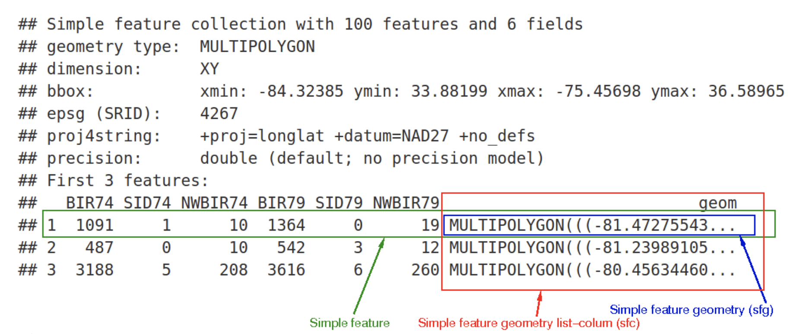

# Tuesday January 31, 2023 {.unnumbered}

**"An awful lot of time I spend"coding" is actually spent copying and pasting (And much of the rest is spent googling)."** -- Meghan Duffy

Today

-   Introduction to simple features
-   Geo-computation on simple features

## Introduction to simple features {.unnumbered}

The vector model for data (vector data) represents things in the world using points, lines and polygons. These objects have discrete, well-defined borders and a high level of precision. Precision does not imply accurate.

The raster model for data (raster data) represents continuous fields (like elevation and rainfall) using a grid of cells (raster). A raster aggregates fields to a given resolution, meaning that they are consistent over space and scale-able. The smallest features within the field are blurred or lost.

The choice data model depends on the application: Vector data dominates the social sciences because human settlements and boundaries have discrete borders. Raster data (e.g., remotely sensed imagery) dominates the environmental sciences because environmental conditions are typically continuous. Geographers, ecologists, demographers use vector and raster data.

Here we will use functions from the {sf} package to work with vector data and functions in the {terra} and {raster} packages to work with raster data sets. We will also look at functions from the new {stars} package that work with both vector and raster data models.

R's spatial ecosystem continues to evolve. Most changes build on previous work. Occasionally there is a significant change that builds from scratch. The introduction of the {sf} package in about 2018 is a significant change.

sf for simple features

Simple features is a standard from the Open ('open source') Geospatial Consortium (OGC) to represent geographic information. It condenses geographic forms into a single geometry class.

The standard is used in spatial databases (e.g., PostGIS), commercial GIS (e.g., ESRI) and forms the vector data basis for libraries such as [GDAL](http://www.gdal.org/). A subset of simple features forms the [GeoJSON](http://geojson.org/) standard. The {sf} package supports these classes and includes plotting and other methods.

Functions in the {sf} package work with all common vector geometry types: points, lines, polygons and their respective 'multi' versions (which group together features of the same type into a single feature). The functions also work with geometry collections, which contain multiple geometry types in a single object. The `raster` data classes are not supported.

The {sf} package incorporates the three main packages of the spatial R ecosystem: {sp} for the class system, {rgdal} for reading and writing data, and {rgeos} for spatial operations done with GEOS.

Simple features are data frames with a column for storing the spatial information. The spatial column is called `geometry` (or `geom`). The geometry column is referenced like a regular column but it has special features.

The geometry column is a 'list column' of class `sfc` (simple feature column). And the `sfc` is a set of objects of class `sfg` (simple feature geometries).



-   green box is a simple feature: a single record (observation), or `data.frame` row, consisting of attributes and geometry
-   blue box is a single simple feature geometry (an object of class `sfg`)
-   red box a simple feature column as a list (an object of class `sfc`, which is a column in the `data.frame`)
-   the geometries are given in well-known text (WKT) format

Geometries are the building blocks of simple features. Well-known text (WKT) is the way simple feature geometries are coded. Well-known binaries (WKB) are hexadecimal strings readable by computers. GIS and spatial databases use WKB to transfer and store geometry objects. WKT is a human-readable text description of simple features. The two formats are exchangeable.

See: <https://en.wikipedia.org/wiki/Well-known_text_representation_of_geometry>

In WKT format a point is a coordinate in 2D, 3D or 4D space (see `vignette("sf1")` for more information) such as:

-   `POINT (5 2)`

The first number is the x coordinate and the second number is the y coordinate.

A line string is a sequence of points with a straight line connecting the points, for example:

-   `LINESTRING (1 5, 4 4, 4 1, 2 2, 3 2)`

Each pair of x and y coordinates is separated by a comma.

A polygon is a sequence of points that form a closed, non-intersecting ring. Closed means that the first and the last point of a polygon have the same coordinates. A polygon has one exterior boundary (outer ring) but it can have interior boundaries (inner rings). An inner ring is called a 'hole'.

-   Polygon without a hole - `POLYGON ((1 5, 2 2, 4 1, 4 4, 1 5))`

Here there are two parentheses to start and two to end the string of coordinates.

-   Polygon with one hole - `POLYGON ((1 5, 2 2, 4 1, 4 4, 1 5), (2 4, 3 4, 3 3, 2 3, 2 4))`

Here the first set of coordinates defines the outer edge of the polygon and the next set of coordinates defines the hole. The outer edge vertexes are connected in a counterclockwise direction. The inner edge vertexes (defining the hole in the polygon) are connected in a clockwise direction.

Simple features allow multiple geometries (hence the term 'geometry collection') using 'multi' version of each geometry type:

-   Multi-point - `MULTIPOINT (5 2, 1 3, 3 4, 3 2)`
-   Multi-string - `MULTILINESTRING ((1 5, 4 4, 4 1, 2 2, 3 2), (1 2, 2 4))`
-   Multi-polygon - `MULTIPOLYGON (((1 5, 2 2, 4 1, 4 4, 1 5), (0 2, 1 2, 1 3, 0 3, 0 2)))`

The difference between a multi-point and multi-string is an extra set of parentheses. The difference between a polygon with a hole and a multi-polygon is that the vertexes of each polygon are connected in a counterclockwise direction.

A collection of these is made:

-   Geometry collection - `GEOMETRYCOLLECTION (MULTIPOINT (5 2, 1 3, 3 4, 3 2), LINESTRING (1 5, 4 4, 4 1, 2 2, 3 2)))`

Simple feature geometry (`sfg`)

The `sfg` class represents the simple feature geometry types: point, line string, polygon (and their 'multi' equivalents, such as multi points) or geometry collection.

Usually you don't need to create geometries. Geometries are part of the spatial data you import. However, there are a set of functions to create simple feature geometry objects (`sfg`) from scratch, if needed. The names of these functions are simple and consistent, as they all start with the `st_` prefix and end with the name of the geometry type in lowercase letters:

-   A point - `st_point()`
-   A linestring - `st_linestring()`
-   A polygon - `st_polygon()`
-   A multipoint - `st_multipoint()`
-   A multilinestring - `st_multilinestring()`
-   A multipolygon - `st_multipolygon()`
-   A geometry collection - `st_geometrycollection()`

An `sfg` object can be created from three data types:

-   A numeric vector - a single point
-   A matrix - a set of points, where each row contains a point - a multi-point or line string
-   A list - any other set, e.g. a multi-line string or geometry collection

To create point objects, you use the `st_point()` function from the {sf} package applied to a numeric vector.

```{r}
sf::st_point(c(5, 2)) # XY point
sf::st_point(c(5, 2, 3)) # XYZ point
```

To create multi-point objects, you use matrices here constructed from the `rbind()` function.

```{r}
mp.matrix <- rbind(c(5, 2), c(1, 3), c(3, 4), c(3, 2))
mp.matrix
sf::st_multipoint(mp.matrix)

ls.matrix <- rbind(c(1, 5), c(4, 4), c(4, 1), c(2, 2), c(3, 2))
sf::st_linestring(ls.matrix)
sf::st_linestring(ls.matrix)

plot(sf::st_multipoint(mp.matrix))
plot(sf::st_linestring(ls.matrix))
```

To create a polygon, you use lists.

```{r}
poly.list <- list(rbind(c(1, 5), c(2, 2), c(4, 1), c(4, 4), c(1, 5)))
sf::st_polygon(poly.list)

poly.border <- rbind(c(1, 5), c(2, 2), c(4, 1), c(4, 4), c(1, 5))
poly.hole <- rbind(c(2, 4), c(3, 4), c(3, 3), c(2, 3), c(2, 4))
poly.with.hole.list <- list(poly.border, poly.hole)
sf::st_polygon(poly.with.hole.list)

plot(sf::st_polygon(poly.list))
plot(sf::st_polygon(poly.with.hole.list))
```

Simple feature geometry column

One `sfg` object contains a single simple feature geometry. A simple feature geometry column (`sfc`) is a list of `sfg` objects together with information about the coordinate reference system.

For example, to combine two simple features into one object with two features, you use the `st_sfc()` function. This is important since `sfg` represents the geometry column in `sf` data frames.

```{r}
point1 <- sf::st_point(c(5, 2))
point2 <- sf::st_point(c(1, 3))
sf::st_sfc(point1, point2)
```

In most cases, a `sfc` object contains objects of the same geometry type. Thus, when you convert `sfg` objects of type `polygon` into a simple feature geometry column, you end up with an `sfc` object of type `polygon`. A geometry column of multiple line strings would result in an `sfc` object of type `multilinestring`.

An example with polygons.

```{r}
poly.list1 <- list(rbind(c(1, 5), c(2, 2), c(4, 1), c(4, 4), c(1, 5)))
polygon1 <- sf::st_polygon(poly.list1)
poly.list2 <- list(rbind(c(0, 2), c(1, 2), c(1, 3), c(0, 3), c(0, 2)))
polygon2 <- sf::st_polygon(poly.list2)
sf::st_sfc(polygon1, polygon2)

plot(sf::st_sfc(polygon1, polygon2))
```

An example with line strings.

```{r}
mls.list1 <- list(rbind(c(1, 5), c(4, 4), c(4, 1), c(2, 2), c(3, 2)), 
                  rbind(c(1, 2), c(2, 4)))
mls1 <- sf::st_multilinestring((mls.list1))
mls.list2 <- list(rbind(c(2, 9), c(7, 9), c(5, 6), c(4, 7), c(2, 7)), 
                  rbind(c(1, 7), c(3, 8)))
mls2 <- sf::st_multilinestring((mls.list2))
sf::st_sfc(mls1, mls2)

plot(sf::st_sfc(mls1, mls2))
```

An example with a geometry collection.

```{r}
sf::st_sfc(point1, mls1)
```

A `sfc` object also stores information on the coordinate reference systems (CRS). To specify a certain CRS, you use the `epsg` or `proj4string` attributes. The default value of `epsg` and `proj4string` is `NA` (Not Available).

```{r}
sf::st_sfc(point1, point2)
```

All geometries in an `sfc` object must have the same CRS. You add coordinate reference system as a `crs =` argument in `st_sfc()`. The argument accepts an integer with the epsg (European Petroleum Survey Group) code (for example, 4326).

```{r}
( sfc1 <- sf::st_sfc(point1, point2, 
                     crs = 4326) )
```

The epsg code is translated to a well-known text (WKT) representation of the CRS.

```{r}
sf::st_crs(sfc1)
```

Here the WKT describes a two-dimensional geographic coordinate reference system (GEOCRS) with a latitude axis first, then a longitude axis. The coordinate system is related to Earth by the WGS84 geodetic datum.

See: <https://en.wikipedia.org/wiki/Well-known_text_representation_of_coordinate_reference_systems>

Simple feature data frames

Features (geometries) typically come with attributes. The attributes might represent the name of the geometry, measured values, groups to which the geometry belongs, etc.

The simple feature class, `sf`, is a combination of an attribute table (`data.frame`) and a simple feature geometry column (`sfc`). Simple feature objects are created using the `st_sf()` function.

Objects of class `sf` behave like regular data frames.

```{r}
methods(class = "sf")
```

Simple features have two classes, `sf` and `data.frame`. This is central to the concept of simple features: most of the time a `sf` can be treated as, and behaves like, a `data.frame`. Simple features are, in essence, data frames but with a column containing the geometric information (`sfc`)

I refer to simple feature objects as 'simple feature data frames' to distinguish them from S4 class spatial data frames.

Many of these functions were developed for data frames including `rbind()` (for binding rows of data together) and `$` (for creating new columns). The key feature of `sf` objects is that they store spatial and non-spatial data in the same way, as columns in a `data.frame`.

The geometry column of {sf} objects is typically called `geometry` but any name can be used.

Thus `sf` objects take advantage of R's data analysis capabilities to be used on geographic data. It's worth reviewing how to discover basic properties of vector data objects.

For example, you get information about the size and breadth of the `world` simple feature data frame from the {spData} package using `dim()`, `nrow()`, etc.

```{r}
library(spData)

dim(world)
nrow(world)
ncol(world)
```

The data contains ten non-geographic columns (and one geometry column) with 177 rows each one representing a country.

Extracting the attribute data from an `sf` object is the same as dropping its geometry.

```{r}
world.df <- world |>
  sf::st_drop_geometry()
class(world.df)
```

Example: Temperatures at FSU and at the airport

Suppose you measure a temperature of 25C at FSU and 22C at the airport at 9a on September 6, 2022. Thus, you have specific points in space (the coordinates), the name of the locations (FSU, Airport), temperature values and the date of the measurement. Other attributes might include a urbanity category (campus or city), or a remark if the measurement was made with an automatic station.

Start by creating to `sfg` (simple feature geometry) point objects.

```{r}
FSU.point <- sf::st_point(c(-84.29849, 30.44188))
TLH.point <- sf::st_point(c(-84.34505, 30.39541))
```

Then combine the point objects into a `sfc` (simple feature column) object.

```{r}
our.geometry <- sf::st_sfc(FSU.point, TLH.point, 
                           crs = 4326)
```

Then create a data frame of attributes.

```{r}
our.attributes <- data.frame(name = c("FSU", "Airport"),
                             temperature = c(25, 22),
                             date = c(as.Date("2022-09-06"), as.Date("2022-09-06")),
                             category = c("campus", "airport"),
                             automatic = c(TRUE, FALSE))
```

Finally create a simple feature data frame.

```{r}
( sfdf <- sf::st_sf(our.attributes, 
                  geometry = our.geometry) )
```

The example illustrates the components of `sf` objects. First, you use coordinates to define the geometry of the simple feature geometry (`sfg`). Second, you can combine the geometries into a simple feature geometry column (`sfc`) which also stores the CRS. Third, you store the attribute information on the geometries in a `data.frame`. Fourth, you use the `st_sf()` function to combine the attribute table and the `sfc` object into a `sf` object.

```{r}
sfdf
class(sfdf)
```

Given a simple feature data frame you create a non-spatial data frame with a geometry list-column but that is not of class `sf` using the `as.data.frame()` function.

```{r}
df <- sfdf |>
  as.data.frame()
class(df)
```

In this case the `geometry` column is

-   no longer a `sfc`.
-   no longer has a plot method, and
-   lacks all dedicated methods listed above for class `sf`

In order to avoid any confusion it might be better to use the `st_drop_geometry()` column instead.

```{r}
df <- sfdf |>
  sf::st_drop_geometry()
```

Example: US states

The object `us_states` from the {spData} package is a simple feature data frame from the U.S. Census Bureau. The variables include the name, region, area, and population.

Simple feature data frames can be treated as regular data frames. But the geometry is "sticky". For example when we create a new data frame containing only the population information the geometry column is included in the new data frame.

```{r}
df1 <- us_states |> 
  dplyr::select(starts_with("total")) 
head(df1)
```

The resulting data frame has the two population columns but also a column labeled `geometry`.

When you use the `summarize()` function, a union of the geometries across rows is made.

```{r}
df2 <- us_states |> 
  dplyr::filter(REGION == "Midwest") |> 
  dplyr::summarize(TotalPop2010 = sum(total_pop_10),
                   TotalPop2015 = sum(total_pop_15))
head(df2)
```

Why use the {sf} package when {sp} is already tried and tested?

-   Fast reading and writing of data
-   Enhanced plotting performance
-   `sf` objects are treated as data frames in most operations
-   `sf` functions are combined using `|>` operator and they work well with the {tidyverse} packages
-   `sf` function names are consistent and intuitive (all begin with `st_`)

These advantages led to the development of spatial packages (including {tmap}, {mapview} and {tidycensus}) that now support simple feature objects.

It is easy to convert between the two classes. Consider the `world` S3 spatial data frame from the {spData} package. You convert it to a S4 spatial data frame with the `as()` method.

```{r}
world.sp <- world |>
  as(Class = "Spatial")
```

The method coerces simple features to `Spatial*` and `Spatial*DataFrame` objects.

You convert a S4 spatial data frame into a simple feature data frame with the `st_as_sf()` function.

```{r}
world.sf <- world.sp |>
  sf::st_as_sf()
```

You can create basic maps from simple feature data frames with the base `plot()` method (`plot.sf()`). The function creates a multi-panel one sub-plot for each variable.

## Geo-computation on simple features {.unnumbered}

Geo-computation on simple features is done with routines in the geometry engine-open source (GEOS) library that the functions in the {sf} package make use of.

As an example, consider the file `police.zip` on my website that contains shapefiles in a folder called `police`. The variables include police expenditures (POLICE), crime (CRIME), income (INC), unemployment (UNEMP) and other socio-economic variables for counties in Mississippi.

Input the data using the `st_read()` function from the {sf} package and then assign a geographic coordinate reference system (CRS) to it using the EPSG number 4326.

```{r}
download.file(url = "http://myweb.fsu.edu/jelsner/temp/data/police.zip",
              destfile = here::here("data", "police.zip"))
unzip(here::here("data", "police.zip"),
      exdir = here::here("data"))

sfdf <- sf::st_read(dsn = here::here("data", "police"), 
                    layer = "police") 
sf::st_crs(sfdf) <- 4326
```

The geometries are polygons and there are 82 of them, one for each county.

You transform the geographic coordinate system of the polygons to a specific projected CRS as suggested by the function `suggest_crs()` from the {crsuggest} package.

```{r}
crsuggest::suggest_crs(sfdf)
```

The function for transforming the CRS is `st_transform()` from the {sf} package.

```{r}
sfdf <- sfdf |>
    sf::st_transform(crs = 6508)
```

The `st_centroid()` function computes the geographic center of each polygon in the spatial data frame.

```{r}
countyCenters.sf <- sfdf |>
    sf::st_centroid()
```

The warning lets you know that the attributes attached to each polygon might result in misleading information when attached to the new geometry (points). Different geometries can mean different interpretations of the attribute.

```{r}
sf::st_geometry(countyCenters.sf)
```

To get a geographic center location for the state, you first join all the counties using the `st_union()` function, then use the `st_centroid()` function.

```{r}
stateCenter.sfc <- sfdf |>
  sf::st_union() |>
  sf::st_centroid()
```

The result is a simple feature geometry column (`sfc`) with a single row where the geometry contains the center location.

Which county contains the geographic center of the state? Here you use the geometric binary predicate `st_contains()`.

```{r}
( Contains <- sfdf |>
    sf::st_contains(stateCenter.sfc,
                    sparse = FALSE) )
```

You include the `sparse = FALSE` argument so the result is a matrix containing `TRUE`s and `FALSE`s. Since there are 82 counties and one centroid the matrix has 82 rows and 1 column. All matrix entries are `FALSE` except the one containing the center.

To map the result you first plot the county polygons with the `geom_sf()` function (layer), then add the county geometry for the center county and fill it red. You use the matrix that you called `Contains` to subset this county. Finally you add the location of the state centroid to the plot.

```{r}
library(ggplot2)

ggplot(data = sfdf) +
  geom_sf() +
  geom_sf(data = sfdf[Contains, ], col = "red") +
  geom_sf(data = stateCenter.sfc) +
  theme_void()
```

The function `st_area()` returns a vector of the geographical area (in sq. units) of each of the spatial objects. Here county boundaries as polygons.

```{r}
sfdf |>
  sf::st_area()
```

The vector values have units of square meters (m\^2), which are derived from the CRS.

There is an attribute called `AREA` in the data frame but it is better to calculate it from the spatial polygons because then you are sure of the units.

What happens when you apply the area function on the centroid object?

```{r}
countyCenters.sf |>
  sf::st_area()
```

Compute a 10 km buffer around the state and show the result with a plot. First use `st_union()`, then `st_buffer()`, then pipe the output (a simple feature data frame to `ggplot()`).

```{r}
sfdf |>
  sf::st_union() |>
  sf::st_buffer(dist = 10000) |>
ggplot() +
  geom_sf() +
  geom_sf(data = sfdf) +
  theme_void()
```

Length of boundary lines for U.S. states. Transform the CRS to 2163 (US National Atlas Equal Area). Note that the geometry is multi-polygons. Convert the polygons to multi-linestrings, then use `st_length()` to get the total length of the lines.

```{r}
states <- spData::us_states |>
  sf::st_transform(crs = 2163)

sf::st_length(states) # returns zeroes because geometry is polygon

states |>
  sf::st_cast(to = "MULTILINESTRING") |>
  sf::st_length()
```
